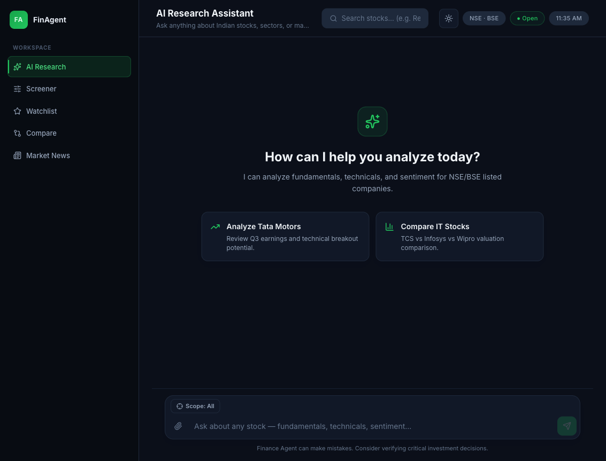
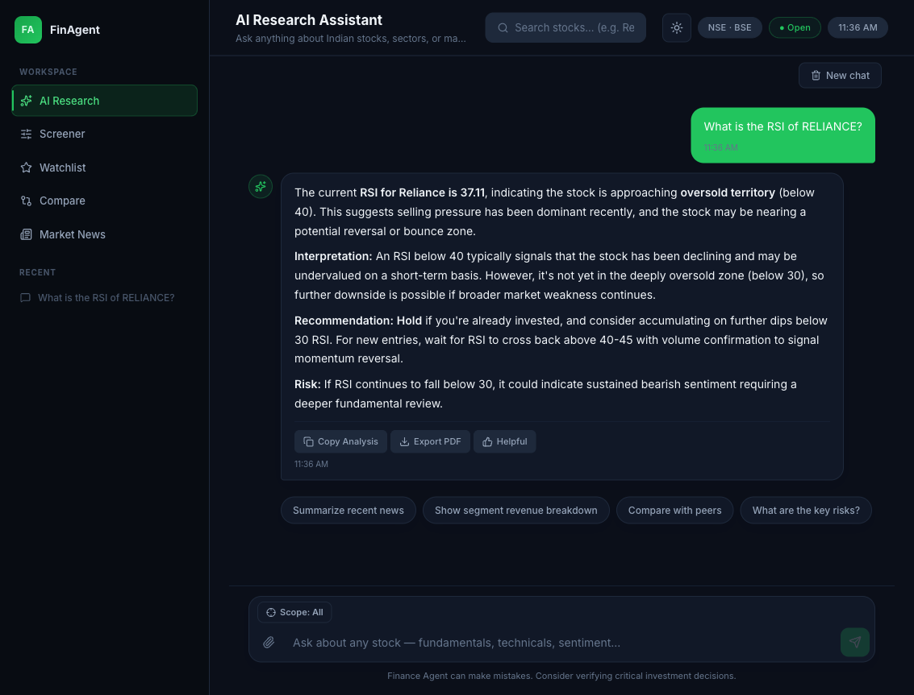
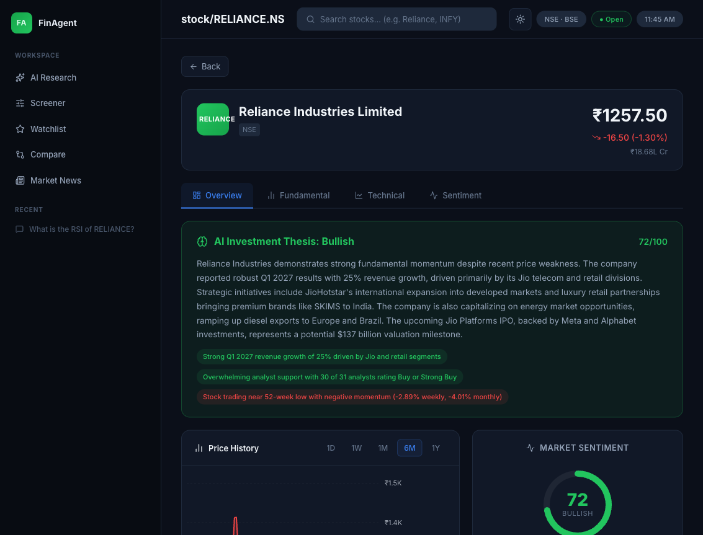
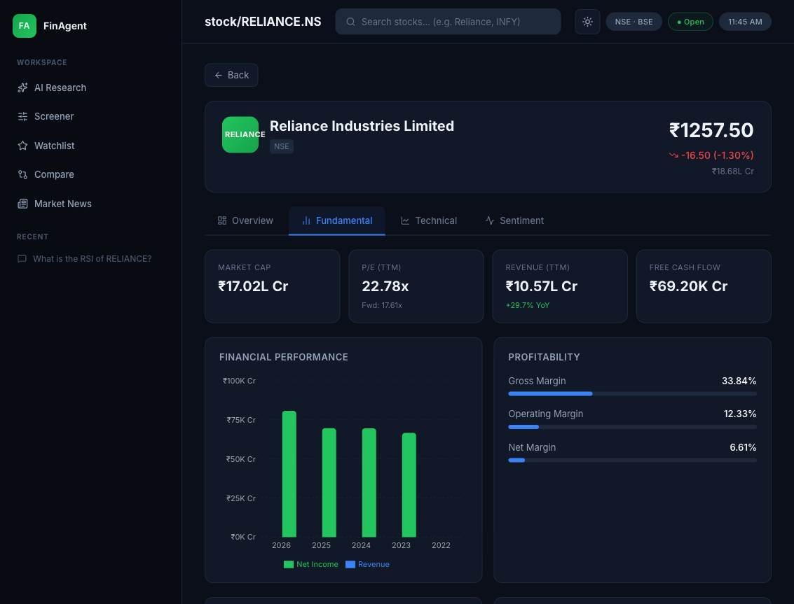
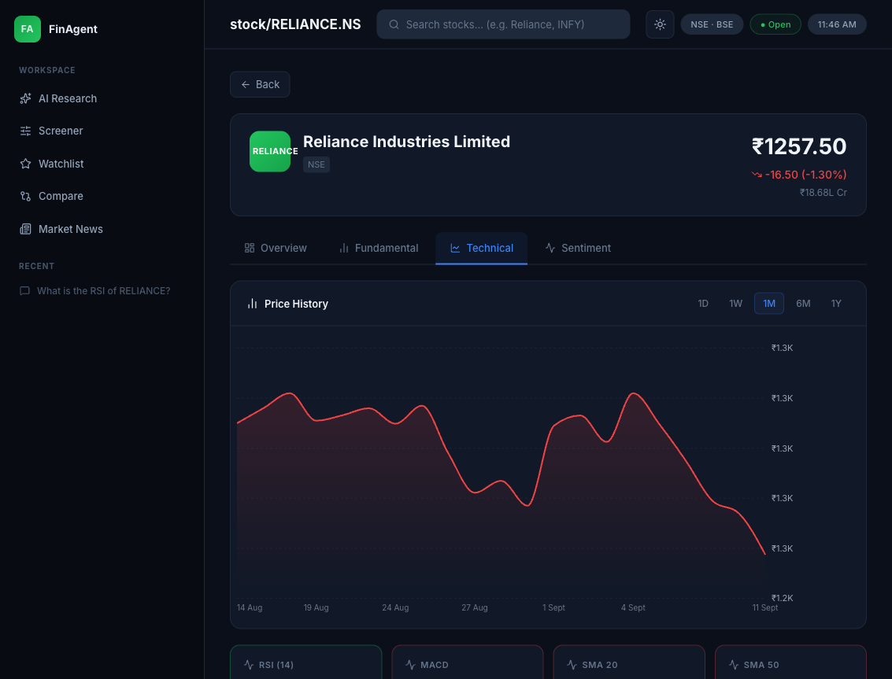
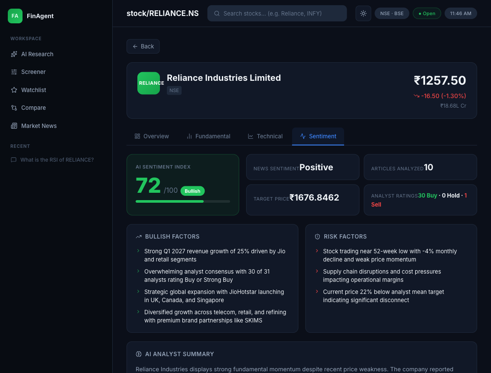
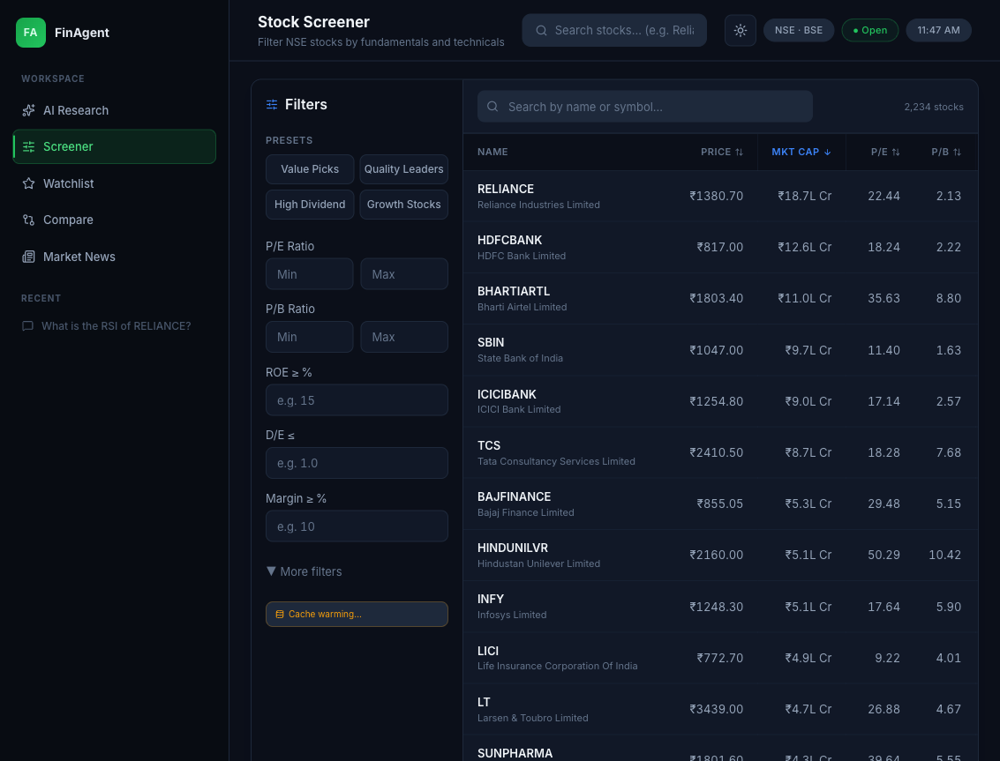
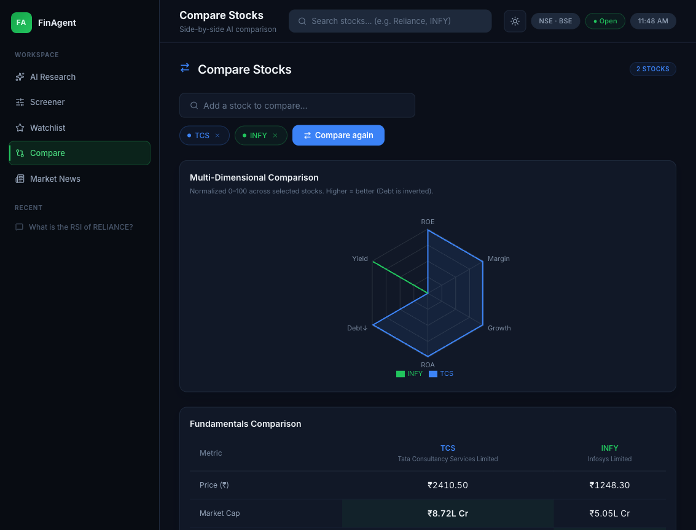
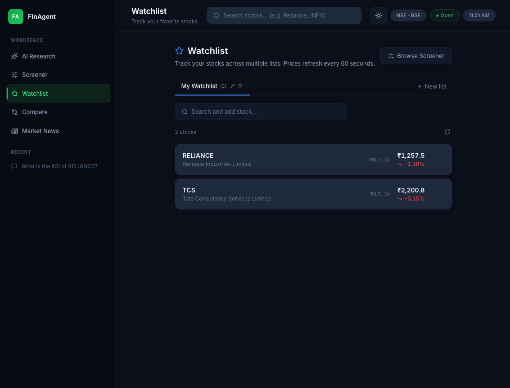
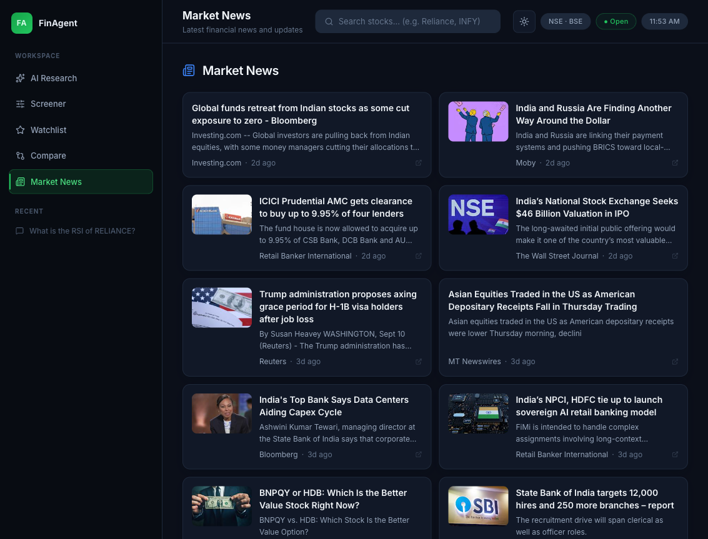

# FinAgent — AI Research Platform for Indian Stock Markets

**FinAgent** is a full-stack, production-grade equity research platform for NSE/BSE stocks. It combines a multi-agent AI system (LangGraph + Anthropic Claude) with real market data (yfinance + pandas-ta) to deliver conversational stock research, technical/fundamental/sentiment analysis, screening, comparison, and watchlists — all wrapped in a polished React UI.

Ask it a question in plain English — *"What is the RSI of Reliance?"*, *"Compare TCS vs Infosys vs Wipro"*, *"Find me high-ROE, low-debt stocks under ₹500"* — and it reasons through the right tool, pulls live data, and streams back a structured, analyst-style answer.



---

## ✨ Key Features

### 🤖 Conversational AI Research
A LangGraph ReAct agent (Anthropic Claude) that reasons over four tools — technical analysis, fundamental analysis, sentiment analysis, and stock screening — and streams its response token-by-token over SSE, with rich data cards rendered inline for every tool call.



### 📊 Stock Detail Dashboard
A single page combining an AI-generated investment thesis, live price + chart, technical indicators, fundamentals, and sentiment — across four tabs.

| Overview | Fundamental |
|---|---|
|  |  |

| Technical | Sentiment |
|---|---|
|  |  |

### 🔍 Stock Screener
Filter all ~2,200 NSE stocks server-side by PE, PB, ROE, ROA, debt/equity, margins, revenue growth, dividend yield, and market cap — backed by a nightly-refreshed PostgreSQL + Redis cache, so results are instant instead of hitting yfinance live.



### ⚖️ AI-Powered Stock Comparison
Pick 2–3 stocks and get a side-by-side fundamentals table, a normalized radar chart (ROE, margin, growth, ROA, debt, yield), and a Claude-generated verdict.



### ⭐ Watchlists
Multiple named watchlists with live price polling every 60 seconds.



### 📰 Market News
Aggregated, deduplicated news across major NSE indices and large-caps, paginated by ticker batch for lazy-loading.



---

## 🏗️ Architecture

```
┌─────────────────────────────┐        ┌──────────────────────────────┐
│   React 18 SPA (Vite)       │  HTTP  │     FastAPI (uvicorn)         │
│   9 pages · 40+ components  │◄──────►│   /api/v1  — REST + SSE       │
└─────────────────────────────┘        └───────────────┬────────────────┘
                                                        │
             ┌───────────────────────────────────────────┤
             │                  │                          │
     ┌───────▼───────┐  ┌───────▼────────┐       ┌────────▼─────────┐
     │   LangGraph    │  │   yfinance     │       │    PostgreSQL     │
     │  Chat Agent +  │  │ + pandas-ta    │       │ stock_metrics_    │
     │  FA Subgraph   │  │  (market data) │       │    history         │
     └───────┬────────┘  └────────────────┘       └───────────────────┘
             │
     ┌───────▼────────┐  ┌────────────────┐
     │   Anthropic     │  │     Redis      │
     │     Claude      │  │ Metrics cache +│
     │      LLM        │  │ LangGraph      │
     └────────────────┘  │ checkpoints    │
                          └────────────────┘
```

### Two LangGraph graphs

**1. Main chat agent** (`app/agent/graph.py`) — a ReAct loop:

```
START → agent (Claude + tools) → tools_condition → tool_node → agent → … → END
```

The agent has four tools it can call based on the user's natural-language query:

| Tool | What it does |
|---|---|
| `calculate_indicator` | Fetches OHLCV via yfinance, computes any of 200+ `pandas-ta` indicators |
| `analyze_fundamentals` | Pulls ratios, income statement, balance sheet, or cash flow via yfinance |
| `analyze_sentiment` | Gathers news + price trend + analyst ratings, sends to Claude for a structured sentiment verdict |
| `screen_stocks` | Queries the PostgreSQL metrics cache with fundamental filters |

**2. Fundamental analysis subgraph** (`app/agent/fundamental/graph.py`) — fan-out / fan-in parallelism:

```
START ──┬─→ ratio_agent ─────┐
        ├─→ cashflow_agent ──┤
        ├─→ balance_sheet_agent ─┼─→ consolidator (Claude) → END
        └─→ pnl_agent ───────┘
```

Four independent agents fetch their data slice concurrently; a consolidator LLM call synthesizes all four into one narrative report. The streaming variant (`fundamental_services.py`) emits `section_complete` events as each finishes, so the UI shows data progressively instead of waiting for everything at once.

### Streaming (SSE)

Both chat and fundamental analysis stream over **Server-Sent Events** with typed events (`tool_start`, `tool_result`, `tool_end`, `token`, `section_complete`, `done`, `error`), letting the frontend render partial results — tool cards, progress states, token-by-token text — as they arrive instead of waiting for one big response.

### Checkpointer fallback chain

On startup, the app tries to attach a LangGraph checkpointer in priority order: **Async Postgres → Async Redis → in-memory**. This means conversation memory works in any environment — full production (Postgres), lightweight dev (Redis only), or zero infra (memory) — without touching code.

### Dual-layer caching

Stock metrics are written to **both PostgreSQL** (for expressive SQL filtering in the screener) **and Redis** (for fast key lookups). An APScheduler cron job refreshes the cache nightly at 06:00 IST; on cold start, it detects an empty Postgres table and either backfills from a warm Redis cache or does a full yfinance refresh.

---

## 🛠️ Tech Stack

**Backend**
- FastAPI + Uvicorn — async REST API
- LangGraph + LangChain — agent orchestration
- Anthropic Claude — LLM (chat, fundamental consolidation, sentiment, comparison)
- yfinance — market data (prices, fundamentals, news, analyst data)
- pandas-ta — 200+ technical indicators
- PostgreSQL 16 + SQLAlchemy (sync + async) — metrics history, screener queries
- Redis Stack — metrics cache, LangGraph checkpointer
- Alembic — auto-run DB migrations on startup
- APScheduler — nightly stock cache refresh job

**Frontend**
- React 18 + Vite
- React Router 7
- Recharts — price charts, radar comparison charts
- Axios — HTTP client
- Zustand — watchlist state
- react-markdown + remark-gfm — render LLM markdown responses
- lucide-react — icons

---

## 📁 Project Structure

```
Finance_agent/
├── app/
│   ├── main.py                     # FastAPI app, lifespan startup, scheduler
│   ├── agent/
│   │   ├── graph.py                 # Main ReAct chat agent (LangGraph)
│   │   ├── tools/                   # 8 agent tools (TA, FA×4, sentiment, screener)
│   │   └── fundamental/
│   │       ├── graph.py             # Parallel fan-out/fan-in FA subgraph
│   │       └── state.py
│   ├── api/v1/endpoints/            # chat, stocks, technical, fundamental, screener, news, config
│   ├── core/                        # settings, checkpointer, redis client
│   ├── db/                          # SQLAlchemy engines + models
│   ├── services/                    # agent, fundamental, sentiment, screener, stock, technical-summary
│   ├── jobs/                        # nightly stock cache refresh job
│   └── llm/                         # Claude model init
├── alembic/                         # DB migrations
├── frontend/src/
│   ├── pages/                       # AIResearch, StockDetail, Screener, Compare, Watchlist, News, ...
│   ├── components/
│   │   ├── ToolResults/             # rich cards for each agent tool's output
│   │   ├── Watchlist/ FundamentalAnalysis/ TechnicalAnalysis/ ...
│   │   └── ui/                      # design system primitives
│   ├── hooks/                       # useChat, useStockAnalysis, useScreener, ...
│   └── services/                    # axios API clients
├── docker-compose.yml                # Postgres + Redis for local dev
└── images/                          # README screenshots
```

---

## 🚀 Getting Started

### Prerequisites
- Python 3.12+
- Node.js 18+
- Docker (for Postgres + Redis)
- An [Anthropic API key](https://console.anthropic.com/)
- [`uv`](https://docs.astral.sh/uv/) for Python dependency management

### 1. Clone and configure

```bash
git clone <this-repo>
cd Finance_agent
echo "ANTHROPIC_API_KEY=your_key_here" > .env
```

### 2. Start Postgres + Redis

```bash
docker compose up -d
```

### 3. Backend

```bash
uv sync
uv run uvicorn app.main:app --reload --host 0.0.0.0 --port 8000
```

Migrations run automatically on startup. API docs: `http://localhost:8000/docs`

### 4. Frontend

```bash
cd frontend
npm install
npm run dev
```

App: `http://localhost:5173`

> If you need to run the backend on a port other than `8000`, create `frontend/.env.local` with `VITE_API_URL=http://localhost:<port>/api/v1`.

---

## 🎯 API Reference

| Method | Endpoint | Description |
|---|---|---|
| `GET` | `/api/v1/config` | Market data config (periods, intervals, indicators) |
| `POST` | `/api/v1/chat/stream` | Stream a chat message via SSE (main agent) |
| `GET` | `/api/v1/chat/history` | Get conversation history for a session |
| `GET` | `/api/v1/stocks/{symbol}/metrics` | Cached fundamental metrics + live price |
| `GET` | `/api/v1/stocks/{symbol}/fundamentals` | Structured ratios/income/balance sheet/cash flow (no LLM) |
| `GET` | `/api/v1/stocks/{symbol}/technical-summary` | RSI/MACD/SMA/BBands + signals (no LLM) |
| `GET` | `/api/v1/stocks/{symbol}/sentiment` | AI sentiment verdict (news + price + analyst data) |
| `GET` | `/api/v1/stocks/{symbol}/news` | Recent news for a stock |
| `GET` | `/api/v1/stocks/{symbol}/history` | OHLCV price history |
| `GET` | `/api/v1/stocks/compare` | AI-powered 2–3 stock comparison |
| `GET` | `/api/v1/technical/chart-data` | OHLCV + full indicator series for charting |
| `POST` | `/api/v1/fundamental/stream` | Stream full or component-level fundamental analysis (SSE) |
| `GET` | `/api/v1/screener/stocks` | Paginated, filtered stock screener |
| `GET` | `/api/v1/news/market` | Paginated market-wide news feed |

Full interactive docs at `/docs` (Swagger) or `/redoc`.

---

## 🗺️ Future Plans

This isn't a speculative wish list — every item below is grounded in something that's already partially built, explicitly configured, or an existing feature waiting to be extended.

### Finish what's already scaffolded
- **Real multi-model / multi-provider support** — `app/core/config.py` already defines `LLM_PROVIDER`, `LLM_MODEL`, `OPENAI_API_KEY`, and `GOOGLE_API_KEY`, but only one of seven LLM call sites (`/stocks/compare`) actually reads `settings.LLM_MODEL` — the other six hardcode the model string directly. Routing every call through a shared factory would make model/provider selection a config change instead of a code change.
- **Session history as a user-facing feature** — the LangGraph checkpointer (Postgres → Redis → in-memory fallback) already persists full conversation history, and `GET /chat/history` already returns it — but the frontend doesn't yet let a user browse past sessions or query against that history.

### Extend what already works
- **Explainable screener presets** — the screener already ships four presets (Value Picks, Quality Leaders, High Dividend, Growth Stocks) built from fixed filter combinations; the natural next step is generating a plain-English explanation of *why* a given preset surfaces the stocks it does.
- **Peer comparison inside stock detail** — the Compare page (radar chart + fundamentals table + AI verdict) already exists as a standalone flow; surfacing an auto-selected "closest peers" version of it directly inside the Stock Detail page removes a manual step instead of inventing a new one.

### New surfaces
- **Mobile client** — the backend is a stateless REST + SSE API with no frontend-specific logic baked in, so a React Native or Flutter client is additive on top of the existing API, not a rewrite.

---

## 📄 License

MIT
